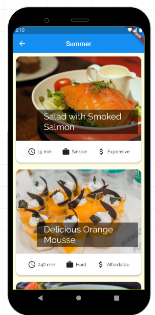
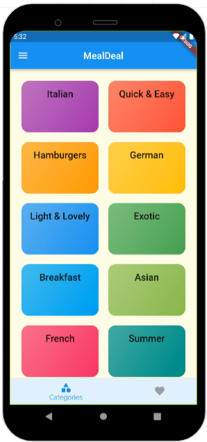
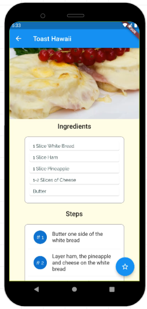

# MealDeal

It's an app for restaurant. App uses setState as state menagment only to prove a concept of usefulness of this app. App can be run using [online emulator](https://appetize.io/app/p2nai6gpc32lk4wum2daeqheoe?device=pixel4&osVersion=11.0&scale=75) 

